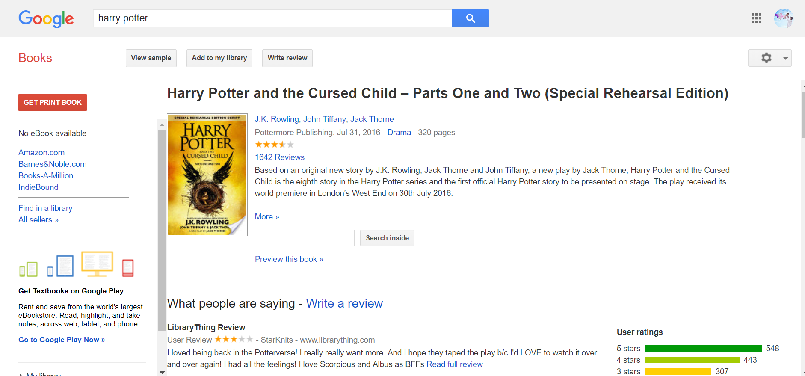

# 📘 Google-Books-Search

#### Google Books Search APP

## 

#
#### 🔎click the book title for detailed info

#
#### 📙saved page

#### 📗Technologies
- [x] MongoDB Mongoose
- [x] Node Express
- [x] React
- [x] Google Books API
- [x] JavaScript/JQuery
- [x] CSS/Bootstrap

#### 📘 Local Install

* `git clone` or download from github
* `npm i` in root, install npm packages
* `npm start` to start node server and react server
* open browser and load http://localhost:3000/

#### 📓 Author
* [Isaac Wu](https://github.com/squall2046)
* [App demo](https://googlebooks-iw.herokuapp.com/)

## Copyright
Isaac Wu © 2019 All Rights Reserved
